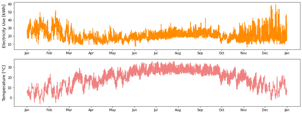
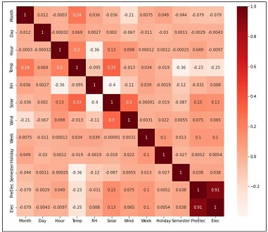
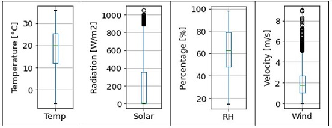
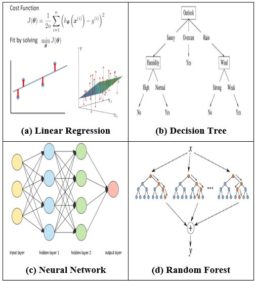
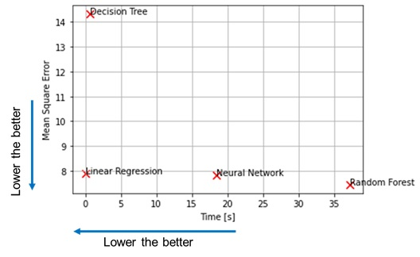

# Building_Energy_Prediction_ML

The code was developed to predict building electricity consumptions using supervised learning algorithms. 

The below building was selected as a test building (Detailed building information wasn't posted here because of privacy).

  

There are a total of 5 steps in this study, as shown below.
1. Data Validation
2. Feature correlations
3. Outlier Data Determination
4. Model Development
5. Result 

#### 1. Data Validation

  

The above figure shows the electricity use and temperature. The two plots are shown because building energy use is highly dependent on the outside temperature. If we think of daily life, when it’s a hot day, we turn on an A/C. Conversely, when it’s a cold day, we turn on a boiler. Besides, we find winter months electricity consumption is higher than in summer months. This is because the heating system’s efficiency is lower than the cooling system. 

#### 2. Feature correlations

  

The above figure depicts the Pearson correlation plot heatmap plot. The correlation of input features with the output target (Elec). The heatmap has values between -1 to 1, which means a value closer to -1 or 1 implies a stronger negative or positive correlation. We found the previous time-step electricity use (PreElec) and electricity consumption (Elec) have a strong linear relationship. Except for this, a strong correlation wasn’t found.

#### 3. Outlier Data Determination

  

We also checked the outlier data using the Box-Whisker plot, as shown in Figure 6. The boxes have lines extending vertically called “whiskers.” These lines indicate variability outside the upper and lower quartiles. Outliers are plotted as individual dots, which are in line with whiskers. Although the solar radiation and wind speed data have outlier data, we decided to include these because we also found similar outlier numbers in other historical weather data. 

#### 4.Model Development

  

As above figure illustrates, we developed five supervised learning models, i) Linear Regression (LR), ii) Decision Tree (DT), iii) Neural Network (NN),  iv) Random Forest (RF). We developed 4 different models because we couldn’t predict which model would show the best performance for the given dataset. 
Further, the K-fold cross-validation was used to reduce bias (CV=10). The cross-validation reduces variance dramatically as most of the data are used in the validation set. 
Additionally, we utilized the mean square error (MSE) as a performance indicator since it reliably measures the accuracy of supervised ML model outcomes.

#### 4. Result 

  

As the above figure illustrates, LR, NN, and RF performed best in terms of prediction accuracy. LR can predict the target as good as NN and RF because of the strong linear relationship between the PreElec feature and Elec target. 
Furthermore, LR and DT predicted the outcome rapidly. The computational time of RF is much higher than DT, while the accuracy of RF is far higher than DT. This is because RF builds multiple random DT and combines the results. LR produced the fastest outcome because of linear calculations' simplicity compared to non-linear calculations in NN and RF.
In conclusion, we advise using the LR model for building energy predictions.
